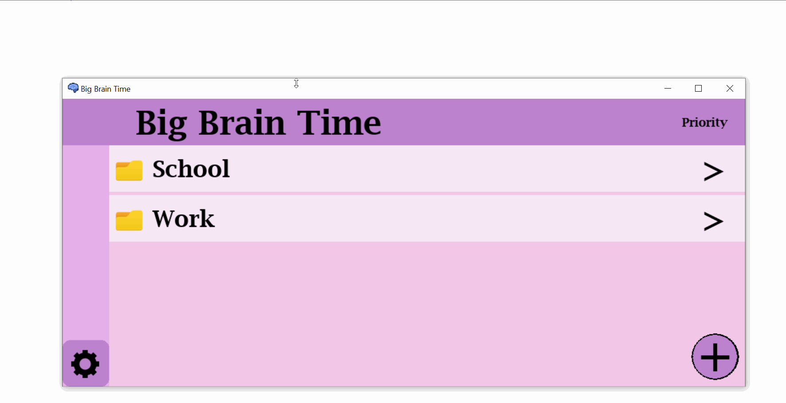
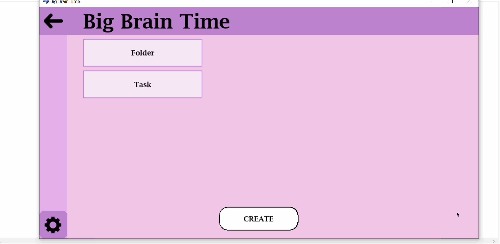
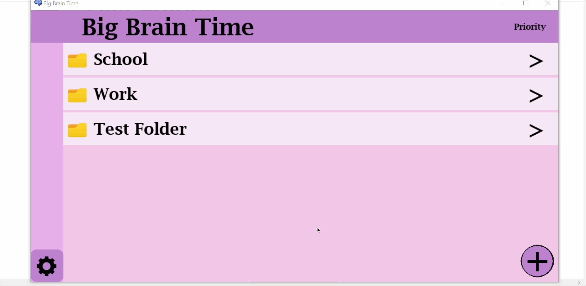
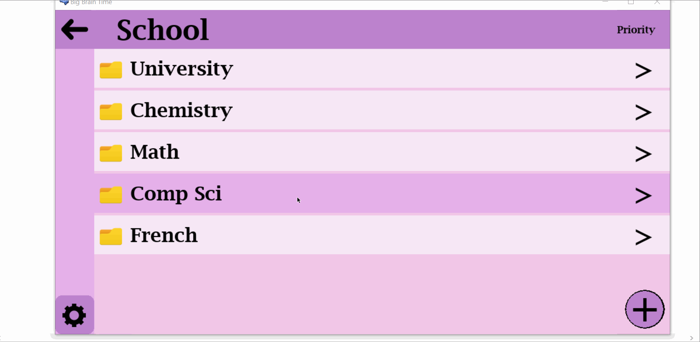
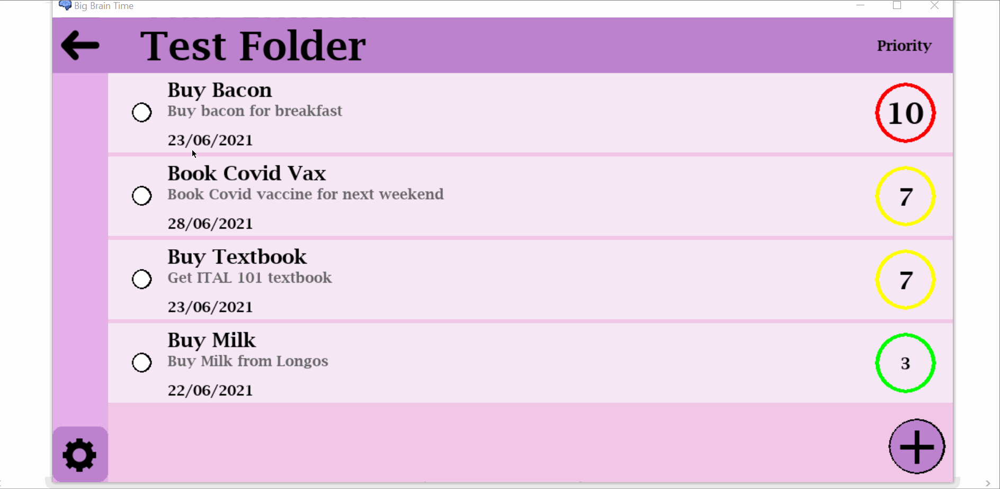
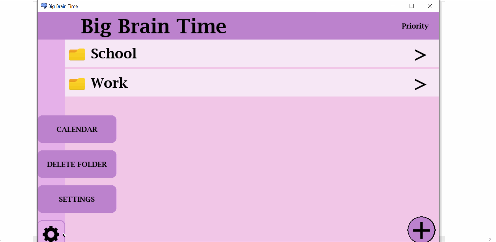

# Big Brain Time

# Table of Contents

- [Big Brain Time](#big-brain-time)
- [Table of Contents](#table-of-contents)
- [Introduction](#introduction)
- [Menu](#menu)
  * [Features](#features)
    + [Resizable](#resizable)
    + [Adding tasks and folders](#adding-tasks-and-folders)
    + [Deleting folders](#deleting-folders)
    + [Sorting](#sorting)
    + [Study Sessions](#study-sessions)
    + [Calendar](#calendar)
    + [Settings](#settings)

# Introduction

Big Brain Time is a task management program made in Python with use of the Pygame module. It is a fully functional task manager that can save tasks using file IO and comes with all the standard features of a great task management app.

This project was made by

[Alex Hyde](https://github.com/Alex-Hyde) 
[Sebastian Villate](https://github.com/Sebvillate) 

# Menu

## Features

### Resizable

To make the program window resizable (Which is not a standard pygame feature), a custom, dynamic, relative rendering module was written for the project to allow all elements on screen to be rendered in a relative position on the window rather than a literal x,y position. This allows X and Y resizing down to an adjustable minimum window size.

### Adding tasks and folders

### Deleting folders

### Sorting

Using the dropdown in the top right, items can be sorted by due date or by prioirity level

 

### Study Sessions

Selecting tasks allows you to begin a study sessions. Each study session is automatically broken down into specific study and break periods according to the Pomodoro Technique, and selecting tasks from the list at the bottom marks them as "done", removing them from the tasks in your folders.

 

### Calendar

The calendar is a useful tool to keep track of tasks, outlining the current day in green and the past in red, and highlighting days where tasks are still due in white. Clicking on a date reveals a dropdown of all the tasks that need to be completed that day, and clicking on a task sends you to its respective folder.

 

### Settings

 

